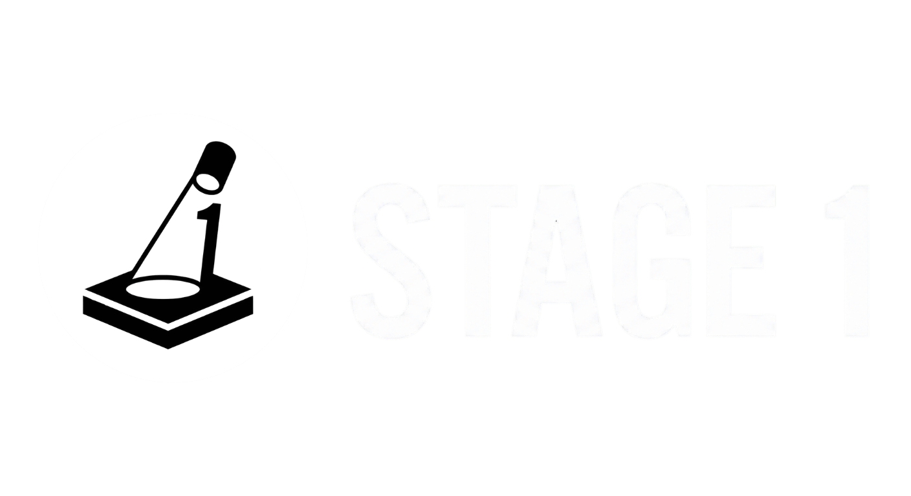

<p align="center">
  
</p>

<h3 align="center">Everything founders need to launch</h3>

<p align="center">
  Free credits, launch directories, startup communities, and playbooks -- all in one place.<br/>
  Open source. No affiliates. Community-owned.
</p>

<p align="center">
  <a href="https://stage1.club">Website</a> &middot;
  <a href="#contributing">Contributing</a> &middot;
  <a href="https://github.com/nikhilsbuilds/stage1/issues">Issues</a>
</p>

---

## What is Stage 1?

Stage 1 is an open source marketplace of verified startup perks, launch directories, communities, and playbooks. Every offer is manually verified -- no affiliate links, no pay-to-rank.

### Features

- **Verified Offers** -- Cloud credits, AI tools, dev tools, and more
- **Launch Directories** -- 50+ places to list your startup
- **Startup Playbooks** -- Pre-built stacks of offers for your stage
- **Reddit Communities** -- Curated list of startup subreddits
- **No Affiliate Links** -- Zero affiliate links, zero pay-to-rank

## Tech Stack

- [Next.js 16](https://nextjs.org) -- App Router, RSC
- [Tailwind CSS](https://tailwindcss.com) -- Styling
- [shadcn/ui](https://ui.shadcn.com) -- UI components
- [Upstash Redis](https://upstash.com) -- Visitor counter
- [Vercel](https://vercel.com) -- Hosting & deployment

## Getting Started

```bash
# Clone the repo
git clone https://github.com/nikhilsbuilds/stage1.git
cd stage1

# Install dependencies
pnpm install

# Set up environment variables
cp .env.example .env.local

# Run the dev server
pnpm dev
```

Open [http://localhost:3000](http://localhost:3000) in your browser.

## Project Structure

```
lib/data.ts          # All offers, playbooks, directories, communities
components/          # Reusable UI components
app/                 # Next.js App Router pages
  offers/            # Offers listing & detail pages
  playbooks/         # Playbooks listing & detail pages
  launch/            # Launch directories page
  communities/       # Reddit communities page
```

## Contributing

We welcome contributions! See [CONTRIBUTING.md](CONTRIBUTING.md) for details.

**Quick ways to contribute:**
- Add a new startup offer
- Add a launch directory
- Add a Reddit community
- Fix a bug or improve the UI
- Suggest a new playbook

## License

MIT -- see [LICENSE](LICENSE) for details.
